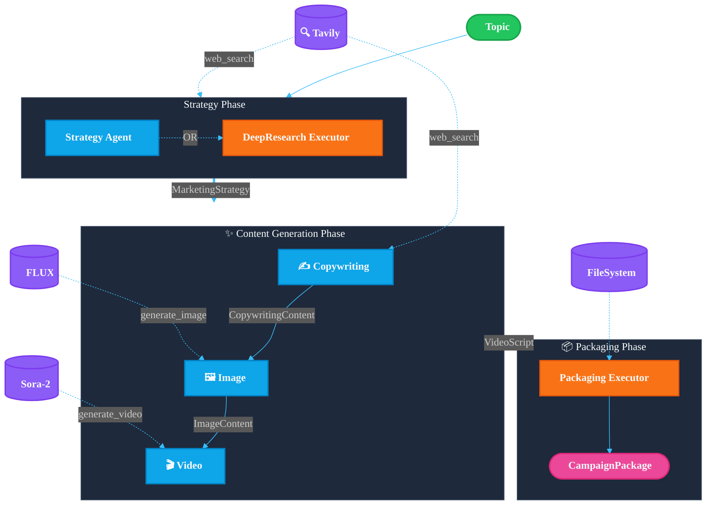
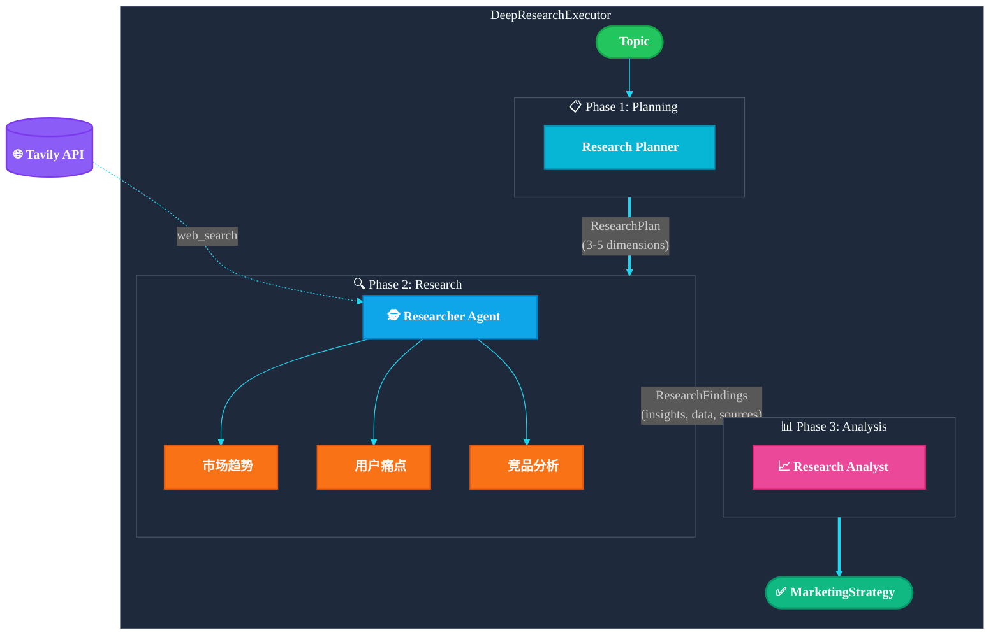

> [English](design.md) | **中文**

# Agentic Marketing Content Workflow - 架构设计

**目标**：输入一个主题 → 自动生成完整营销素材包

## 系统架构



## Agent 职责

| Agent | 输入 | 输出 | 工具 |
|-------|------|------|------|
| **Strategy Agent** | 主题 | `MarketingStrategy` | `web_search` |
| **DeepResearch Executor** | 主题 | `MarketingStrategy` | `web_search` (多轮) |
| **Copywriting Agent** | Strategy | `CopywritingContent` | `web_search` |
| **Image Agent** | Strategy + Copy | `ImageContent` | `generate_image` (FLUX) |
| **Video Agent** | Strategy + Copy | `VideoScript` | `generate_video` (Sora-2) |
| **Packaging Executor** | 全部输出 | `CampaignPackage` | 文件系统 |

## 深度研究模式 (DeepResearchExecutor)

当启用 `--deep-research` 时，Strategy Agent 被替换为 DeepResearchExecutor。

### 架构图



### 三阶段详细流程

#### Phase 1: Research Planning (研究规划)

**Planner Agent** 分析主题，输出结构化研究计划：

```json
{
  "topic_analysis": "主题的核心理解和营销场景",
  "research_dimensions": [
    {
      "dimension": "市场趋势",
      "priority": "high",
      "search_queries": ["ESP32 IoT 市场趋势 2024", "ESP32 market trends"],
      "info_needed": ["市场规模", "增长率", "应用场景"]
    },
    {
      "dimension": "目标用户",
      "priority": "high", 
      "search_queries": ["创客 工作坊 痛点", "maker workshop challenges"],
      "info_needed": ["用户画像", "学习障碍", "需求痛点"]
    },
    {
      "dimension": "竞品分析",
      "priority": "medium",
      "search_queries": ["Arduino 工作坊 vs ESP32", "IoT workshop comparison"],
      "info_needed": ["竞争对手", "差异化机会"]
    }
  ],
  "target_insights": ["市场机会", "用户痛点", "差异化定位"]
}
```

#### Phase 2: Research Execution (研究执行)

**Researcher Agent** 按优先级执行多轮 `web_search`：

1. 遍历 `research_dimensions`，按 priority 排序
2. 对每个维度执行其 `search_queries`
3. 使用 `search_depth="advanced"` 获取深度结果
4. 提取并结构化关键信息

输出格式：
```json
{
  "research_findings": [
    {
      "dimension": "市场趋势",
      "key_insights": ["ESP32 在边缘AI领域增长迅速", "TinyML 是热门方向"],
      "data_points": ["全球 IoT 市场预计 2025 年达 1.1 万亿美元"],
      "trends": ["边缘计算", "低功耗AI"],
      "sources": ["https://..."]
    }
  ],
  "market_overview": "市场整体概况...",
  "competitive_landscape": "竞争格局描述...",
  "opportunity_areas": ["教育市场", "企业培训"]
}
```

#### Phase 3: Strategy Synthesis (策略综合)

**Analyst Agent** 综合研究数据，生成最终 `MarketingStrategy`：

- 基于真实数据定义目标受众
- 从研究发现提炼用户痛点
- 根据市场机会设计差异化卖点
- 输出符合 schema 的 JSON

## 数据模型

```python
MarketingStrategy:
  topic, target_audience, tone_of_voice
  pain_points[], selling_points[], content_framework[]
  brand_pillars[], keywords[]

CopywritingContent:
  hero_message
  social_posts[] (LinkedIn, Instagram, 小红书, Twitter)
  blog_article, blog_outline[]
  pain_point_analysis[], cta_variations[]

ImageContent:
  prompts[] (prompt_id, prompt, scene_description)
  assets[] (prompt_id, url, local_path)

VideoScript:
  scenes[] (scene_number, act, voiceover, screen_text, duration_seconds)
  total_duration_seconds, cta, srt_caption

CampaignPackage:
  campaign_id, topic, created_at
  strategy, copywriting, images, video
  package_path
```

## 输出目录

```
artifacts/campaigns/20251201_campaign/
├── manifest.json
├── strategy/
│   ├── strategy.json
│   └── strategy.md
├── copywriting/
│   ├── hero_message.md
│   ├── blog.md
│   └── social_posts.json
├── images/
│   ├── prompts.json
│   └── *.png
└── video/
    ├── video_script.json
    └── *.mp4
```

## 运行模式

| 模式 | 命令 | 特点 |
|------|------|------|
| 基础 | `cli "主题"` | 单次 LLM 调用生成策略 |
| 深度研究 | `--deep-research` | 多轮 web 搜索 + 数据驱动 |
| 图像生成 | `--enable-image-gen` | FLUX 模型生成图片 |
| 视频生成 | `--enable-video-gen` | Sora-2 模型生成视频 |
