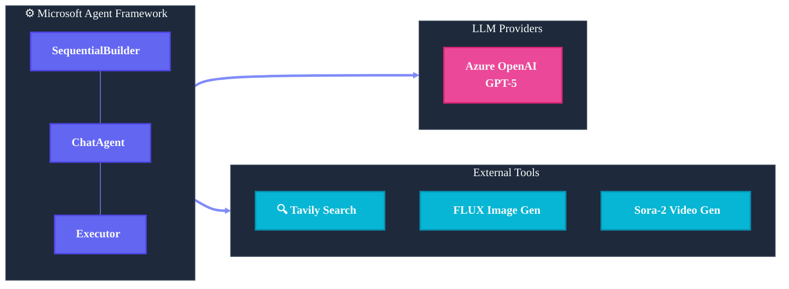
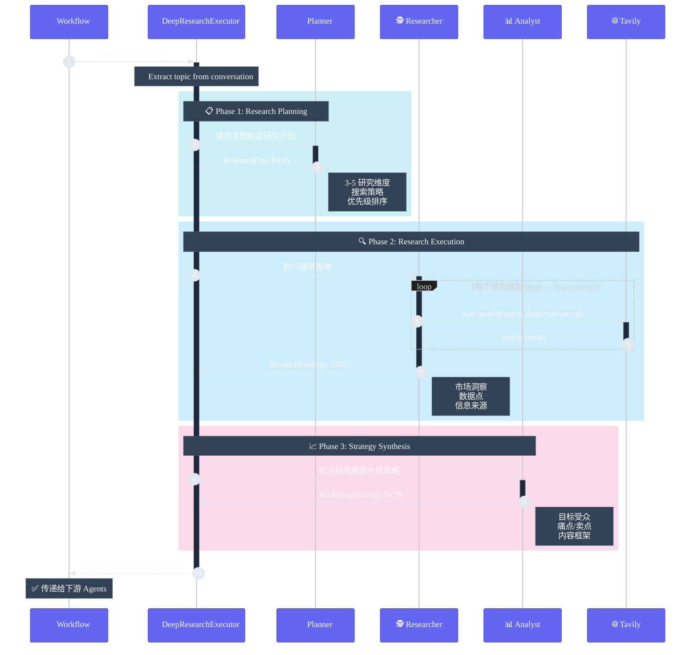

> [English](spec.md) | **中文**

# 技术规范

基于 Microsoft Agent Framework 的自动化营销内容生成系统。

## 技术栈



## 核心组件

### 1. AgenticMarketingWorkflow

主工作流类，负责：
- 初始化 ChatClient 和工具
- 创建 Agent 和 Executor
- 使用 SequentialBuilder 编排工作流
- 处理事件流和调试输出

```python
class AgenticMarketingWorkflow:
    def __init__(self, chat_client, *, config=None):
        # 初始化工具: TavilySearchTools, FluxImageGenerationTools, SoraVideoGenerationTools
        # 创建 Agents: create_marketing_agents()
        # 可选: 创建 DeepResearchExecutor

    async def run(self, topic: str) -> CampaignPackage:
        # 创建工作流并执行
        workflow = self._create_workflow(campaign_dir)
        async for event in workflow.run_stream(topic):
            # 处理事件...
```

### 2. Agent 定义 (agents.py)

四个专业 ChatAgent：

```python
def create_marketing_agents(chat_client, tool_registry=None) -> MarketingAgents:
    return MarketingAgents(
        strategy=_build_agent("strategy_agent", strategy_instructions),
        copywriting=_build_agent("copywriting_agent", copy_instructions),
        image=_build_agent("image_agent", image_instructions),
        video=_build_agent("video_agent", video_instructions),
    )
```

**Strategy Agent** - 执行多轮 web 搜索：
- 规划搜索策略（市场趋势、竞品、用户痛点）
- 至少调用 3 次 `web_search`
- 综合分析输出 MarketingStrategy

**Copywriting Agent** - 知识类种草文案专家：
- 第一人称真实体验感
- 痛点共鸣 → 发现方法 → 效果 → 行动引导
- 输出多平台文案 (LinkedIn, Instagram, 小红书)

**Image Agent** - 图像提示词工程师：
- 设计英文 prompt
- 可选调用 `generate_image` 工具

**Video Agent** - 视频脚本专家：
- 三幕式结构 (Problem/Solution/Transformation)
- 最多 6 场景，总时长 ≤72 秒
- 可选调用 `generate_video` 工具

### 3. DeepResearchExecutor (research.py)

可选的深度研究模式，替换 Strategy Agent。

#### 内部架构



#### 三个内部 Agent

| Agent | 职责 | 输入 | 输出 |
|-------|------|------|------|
| **Planner** | 分析主题，制定研究维度 | topic | ResearchPlan |
| **Researcher** | 执行多轮 web_search | ResearchPlan | ResearchFindings |
| **Analyst** | 综合分析，生成策略 | Plan + Findings | MarketingStrategy |

#### 实现代码

```python
class DeepResearchExecutor(Executor):
    def __init__(self, chat_client, search_tool, debug=False):
        self._research_agents = create_research_agents(chat_client, search_tool)

    @handler
    async def handle(self, conversation, ctx):
        topic = self._extract_topic(conversation)
        
        # Phase 1: Research Planning
        plan = await self._run_planning(topic)
        # -> {"research_dimensions": [...], "target_insights": [...]}
        
        # Phase 2: Execute Research (多轮搜索)
        findings = await self._run_research(topic, plan)
        # -> {"research_findings": [...], "market_overview": "..."}
        
        # Phase 3: Synthesize Strategy
        strategy = await self._run_analysis(topic, plan, findings)
        # -> MarketingStrategy JSON
        
        await ctx.send_message([...conversation, strategy_message])
```

### 4. 工具实现 (tools.py)

**TavilySearchTools** - Web 搜索：
```python
@ai_function
def web_search(query, search_depth="basic", max_results=5) -> dict
```

**FluxImageGenerationTools** - FLUX 图像生成：
```python
@ai_function
def generate_image(prompt, prompt_id, size="1024x1024") -> dict
```

**SoraVideoGenerationTools** - Sora-2 视频生成：
```python
@ai_function  
def generate_video(prompt, scene_id, seconds=5, size="1280x720") -> dict
```

### 5. PackagingExecutor

收集所有 Agent 输出，组装为 CampaignPackage：

```python
class _PackagingExecutor(Executor):
    @handler
    async def handle(self, conversation, ctx):
        package = self._build_package(conversation)
        package = package.with_package_path(
            self._packaging_tools.persist_package(package)
        )
        await ctx.yield_output(package)
```

## 工作流编排


```python
builder = SequentialBuilder().participants([
    strategy_participant,  # Strategy Agent 或 DeepResearchExecutor
    self._agents.copywriting,
    self._agents.image,
    self._agents.video,
    packaging_executor,
])
workflow = builder.with_checkpointing(checkpoint_storage).build()
```

## 配置选项

```python
@dataclass
class MarketingWorkflowConfig:
    persist_output: bool = True
    output_dir: str = "artifacts/campaigns"
    enable_image_generation: bool = False
    enable_video_generation: bool = False
    enable_deep_research: bool = False
    debug: bool = False
```

## 环境变量

```env
# 必需
AZURE_OPENAI_ENDPOINT=
AZURE_OPENAI_API_KEY=
AZURE_OPENAI_CHAT_DEPLOYMENT_NAME=
Tvly_API_KEY=

# 可选 - 图像生成
AZURE_IMAGE_ENDPOINT=
AZURE_IMAGE_API_KEY=

# 可选 - 视频生成
AZURE_VIDEO_ENDPOINT=
AZURE_VIDEO_API_KEY=
```

## 约束与限制

- **Sora-2 视频**: 时长只能是 4/8/12 秒，API 并发限制 2
- **FLUX 图像**: Prompt 必须英文
- **GPT-5**: 推理模型，不支持自定义 temperature
