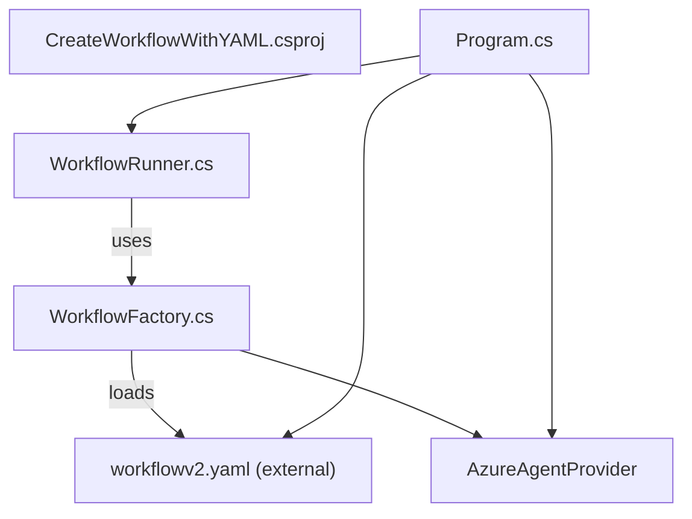

# Project Architecture

```mermaid
flowchart TB
    proj["CreateWorkflowWithYAML.csproj"]
    program["Program.cs"]
    factory["WorkflowFactory.cs"]
    runner["WorkflowRunner.cs"]
    yaml["workflowv2.yaml (external)"]
    agent["AzureAgentProvider"]
    runner -->|uses| factory
    factory -->|loads| yaml
    factory --> agent
    program --> runner
    program --> yaml
    program --> agent
```
