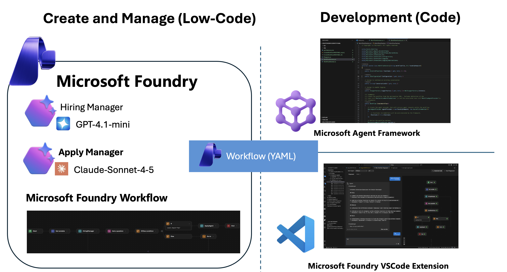
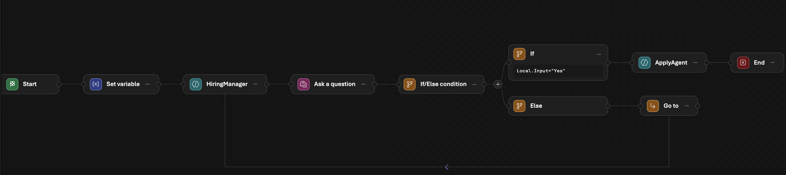
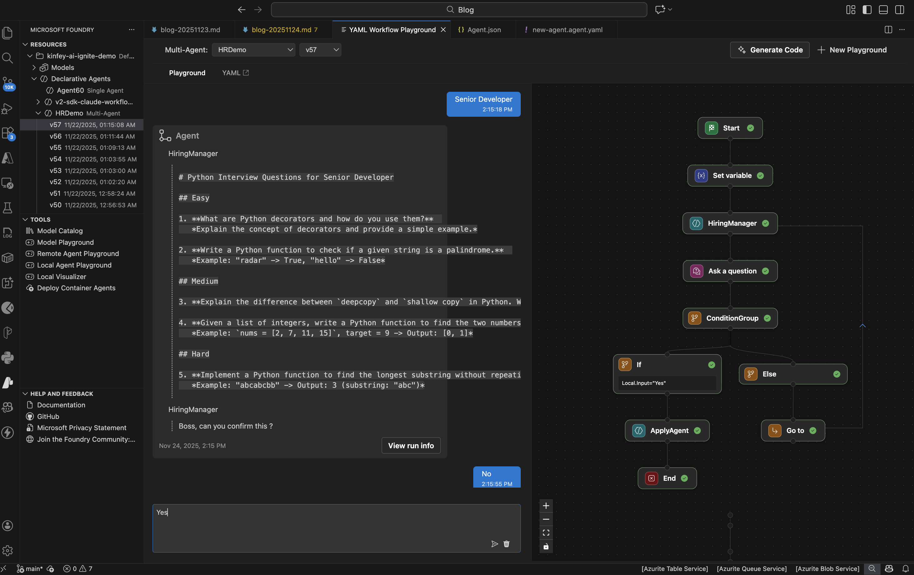
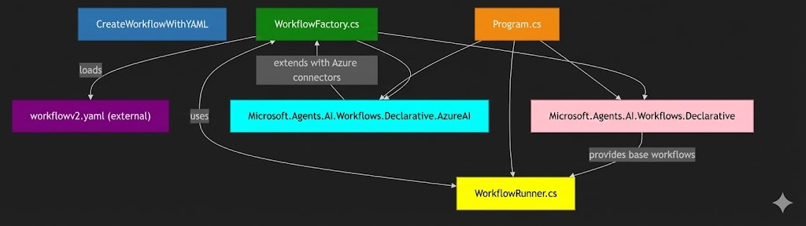

# From Concept to Code: Building Production-Ready Multi-Agent Systems with Microsoft Foundry

**Core Theme**

The blog post discusses the evolution of AI from passive content generation to active task execution. It introduces Microsoft Foundry's new capabilities—specifically the Agent Framework, Agent V2 SDK, and VSCode Extensions—designed to bridge the gap between theoretical AI research and secure, scalable enterprise applications.

**The Scenario: Recruitment Process**

To demonstrate these capabilities, the post uses a "Recruitment" scenario involving two distinct agents:

* **The Recruiter Agent:** Sets job requirements and generates interview questions.

* **The Applicant Agent:** Synthesizes answers to meet the recruiter's criteria..

**The Three Phases of Development**

The post outlines a three-stage process to take this multi-agent system from design to deployment:

1. **Design (Low-Code) – Foundry Workflows**

    * Developers use a visual, drag-and-drop interface in Microsoft Foundry to orchestrate agents and deterministic business logic (like IF/ELSE conditions)
    * This "low-code" approach allows for rapid prototyping and visualizing data flow without writing complex orchestration logic from scratch.
    * The design can be tested immediately in the cloud and exported as YAML configuration.

    ***Note*** - Please go to [./YAML](./YAML/) to create agents and workflows

    

2. **Develop (Local SDLC) – VSCode Extension**

    * To move from a cloud prototype to a rigorous Software Development Lifecycle (SDLC), the Microsoft Foundry VSCode Extension is used.
    * This allows developers to **sync** workflow definitions from the cloud to their local machine, **inspect** the logic, and **scaffold** the necessary code structures.
    * This phase bridges the gap between the visual design canvas and the local coding environment.

    

3. **Deploy (Native Runtime) – Microsoft Agent Framework**

    * The Microsoft Agent Framework serves as the runtime engine that natively ingests the declarative YAML files exported from Foundry[cite: 216, 217].
    * This enables "Configuration as Code," where artifacts from the prototyping phase are directly promoted to production without rewriting logic[cite: 218, 241].
    * Developers can initialize the entire system with minimal boilerplate code.

    ***Note*** - Please go to [./CreateWorkflowWithYAML/](./CreateWorkflowWithYAML/) to run 

    

**Conclusion**

Microsoft Foundry provides a comprehensive solution that enables developers to build adaptive, multi-agent systems that drive real business value, moving beyond simple conversational interfaces to sophisticated process automation.